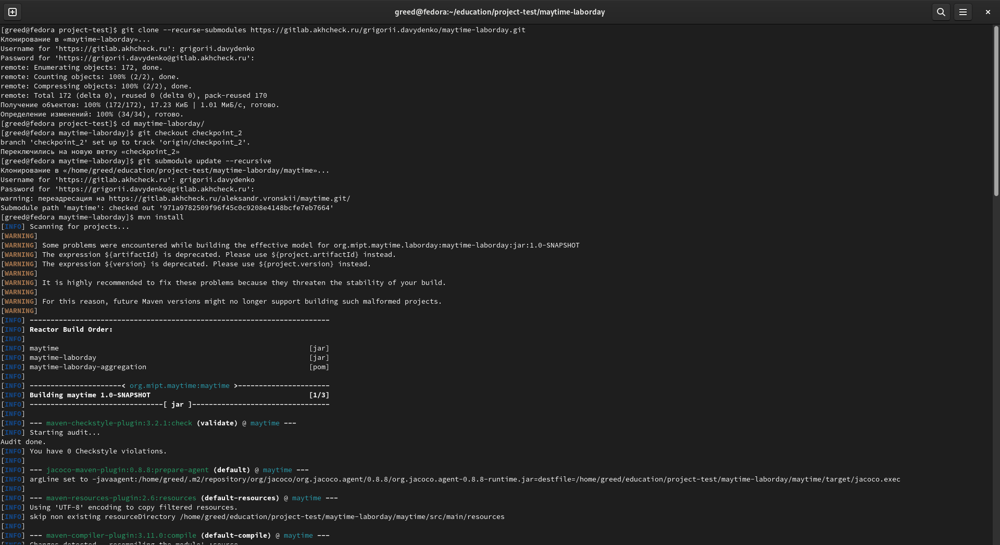
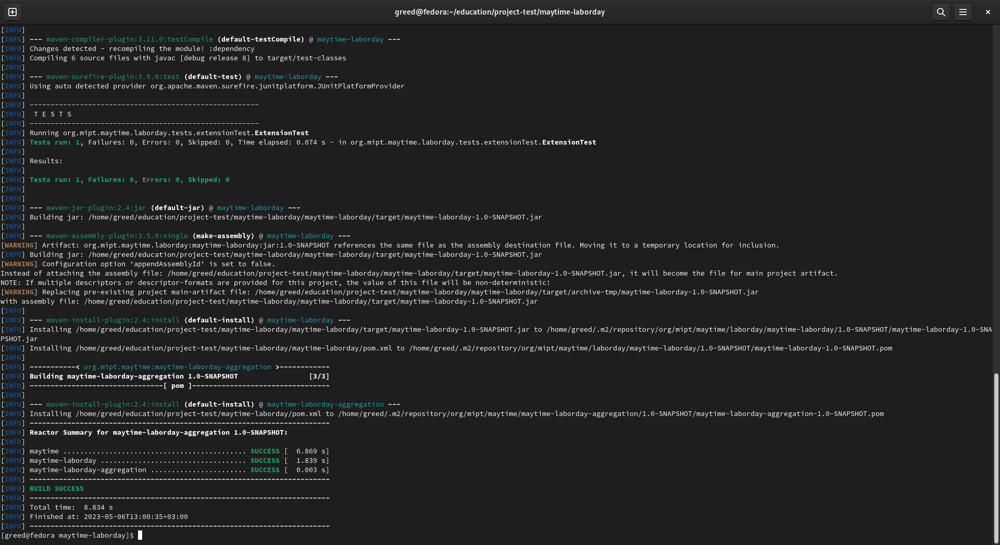
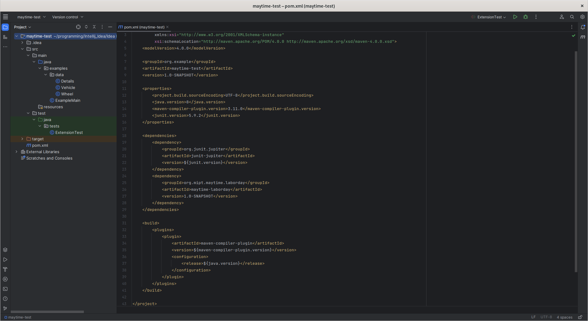
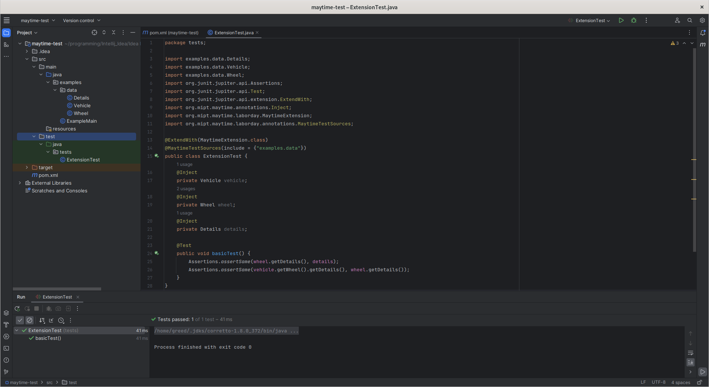

# MAYTIME-LABORDAY
### About project

Maytime-laborday is extension for Maytime framework which provides user by testing tools for programs
which were written using Maytime.

Use ready-made annotations to test your applications.

### Requirements

- Java version 1.8+
- Maven - build and management tool for Java-projects

### Usage
#### Step 1: Installation

Before all, clone Maytime-laborday in your workspace and run mvn install command:

```
git clone https://github.com/DavydenkoGr/maytime-laborday
cd maytime-laborday
git submodule update --recursive
mvn install
```

#### Step 2: Adding a dependency

The next step is to add a dependency to your own project:

```
<dependency>
    <groupId>org.mipt.maytime.laborday</groupId>
    <artifactId>maytime-laborday</artifactId>
    <version>1.0-SNAPSHOT</version>
</dependency>
```

#### Step 3: Import required classes

After adding a dependency, you may import the following classes to configure your tests:

```
import org.mipt.maytime.annotations.Inject;
import org.mipt.maytime.laborday.MaytimeExtension;
import org.mipt.maytime.laborday.annotations.MaytimeTestSources;
```

#### Step 4: Configuration

Annotate your test classes using @ExtendWith(MaytimeExtension.class).
Annotate the fields which you want to fill with components using the @Inject annotation.
If you use classes from different sources, use @MaytimeTestSources annotation to specify them.

### Usage examples
#### Installation

  


#### Dependency



#### Test example



### Authors:

- *Davydenko Grigorii*
  - GitHub: *@DavydenkoGr*
  - Telegram: *@desertSmoke42*
- *Vronskii Alexander*
  - GitHub: *@asvronsky*
  - Telegram: *@asvronsky*
